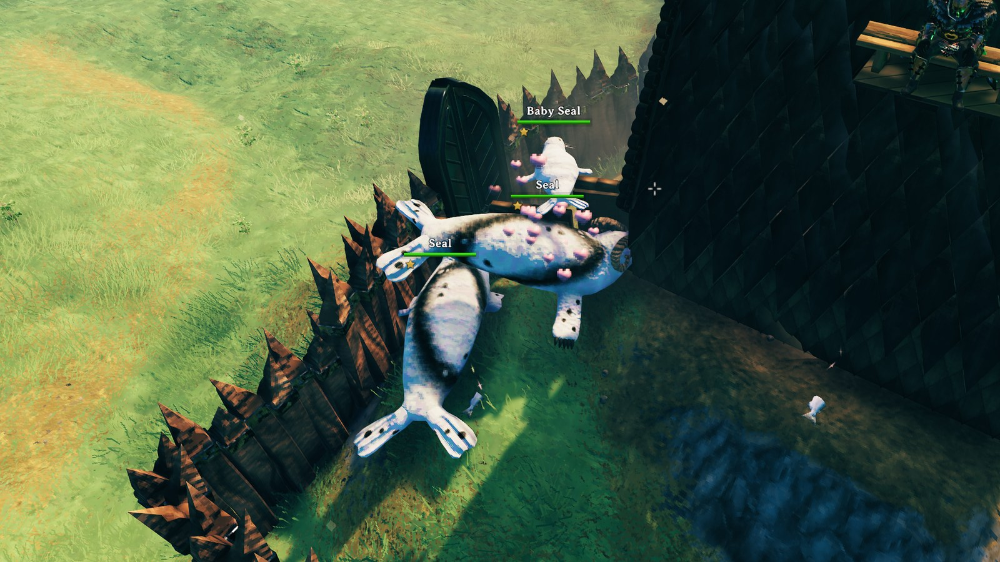

# SealsAtHome

[](https://github.com/algo7/SealsAtHome/actions/workflows/ci.yml)

A client-side [BepInEx](https://github.com/BepInEx/BepInEx) mod for Valheim: tame seals like any vanilla tameable, breed
them, and keep pups as babies by naming them. Players without the mod only ever see vanilla things.



What it does for players is in [package/README.md](package/README.md), which is also the mod's Thunderstore page.
Changes: [CHANGELOG.md](CHANGELOG.md).

Made with AI assistance.

## How it works

On each world load (Unity's `sceneLoaded`, after `ZNetScene` registered its prefabs and before any creature exists) the
vanilla `Seal` and `Seal_Pup` prefabs are rebuilt in place: `Character` → `Humanoid`, `AnimalAI` → `MonsterAI` (tuned to
act like the vanilla seal), plus vanilla `Tameable`, `Procreation` (adults) and a small `SealCare` component (wild / tamed
AI switch, pet names for players without the mod, pups growing up). No Harmony patches; every value is vanilla and
checked against the game's types by the unit tests and by a pre-flight before anything changes.

## Building

Needs the .NET SDK 8 and Valheim's game DLLs for compile-time references: by default from a local Steam install
(`~/.local/share/Steam/steamapps/common/Valheim`). BepInEx comes from NuGet (`nuget.config` adds the BepInEx feed).

```sh
make test       # unit tests (no game needed at runtime, only its DLLs as references)
make package    # → Algo7-SealsAtHome-<version>.zip (manifest.json is generated from SealsAtHome.csproj)
make test MANAGED_DIR=/path/to/Valheim/valheim_Data/Managed    # game DLLs from elsewhere
```

Install the zip with r2modman ("Import local mod"), or copy `SealsAtHome.dll` into `BepInEx/plugins/`.
The Makefile looks for the SDK in `~/.dotnet`; pass `DOTNET=dotnet` if it's on your PATH.

## CI / CD

- **CI** (`.github/workflows/ci.yml`, every push and pull request): build, unit tests and the zip as an artifact. The
  game DLLs come from Valheim's free dedicated server (Steam app 896660, anonymous login): only its `Managed` DLLs,
  fetched with [DepotDownloader](https://github.com/SteamRE/DepotDownloader) (pinned, checksum-verified); nothing from
  the game is committed.
- **Release** (`.github/workflows/release.yml`): the version comes from the git tag
  ([MinVer](https://github.com/adamralph/minver)); nothing else holds a version number. To release:
  1. add a `## X.Y.Z` section with the release notes to [CHANGELOG.md](CHANGELOG.md), **above the previous release's
     `##` section** (the whole file is shown as the Thunderstore Changelog tab, newest first), and push it;
  2. tag the commit that has those notes: `git tag vX.Y.Z && git push origin vX.Y.Z` (the release stops if the tagged
     commit has no `## X.Y.Z` section);
  3. approve the run in the `thunderstore` environment: it creates the GitHub Release and publishes the same zip to
     Thunderstore (`tcli`, secret `TCLI_AUTH_TOKEN`).
- **Dependabot**: NuGet packages and GitHub Actions, weekly.

## Layout

```
SealsAtHome.csproj         net48 plugin; Package target (zip + generated manifest)
src/                       plugin: scene hook, prefab rebuild, settings tables, rules, SealCare component
package/                   Thunderstore README and icon (icon.svg is its source)
images/                    screenshots for the READMEs (not in the zip)
tests/                     unit tests (net8.0)
thunderstore.toml          Thunderstore publishing settings (tcli)
.github/                   workflows, Dependabot, the CI helper that fetches the game DLLs
```

## License

[MIT](LICENSE)
