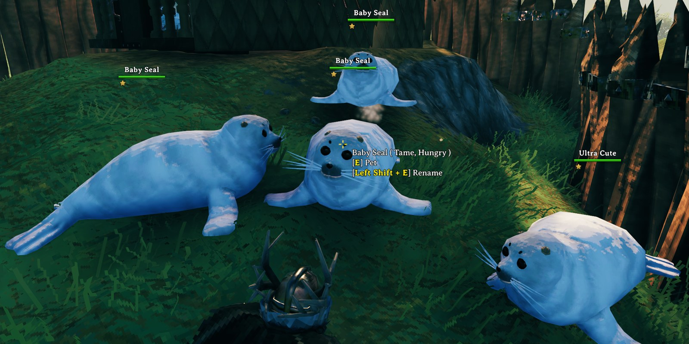

# SealsAtHome

[](https://github.com/algo7/SealsAtHome/actions/workflows/ci.yml)

A client-side [BepInEx](https://github.com/BepInEx/BepInEx) mod for Valheim: tame seals like any vanilla tameable, breed
them, and keep pups as babies by naming them. Players without the mod only ever see vanilla things.



What it does for players is in [package/README.md](package/README.md), which is also the mod's Thunderstore page.
Changes: [CHANGELOG.md](CHANGELOG.md).

Made with AI assistance.

## How it works

### AnimalAI and MonsterAI

Valheim gives creatures one of two brains, both derived from `BaseAI`:

- **`AnimalAI`** (deer, seals, the cubs of tameables): wander, notice a threat, run until it feels safe (`m_timeToSafe`).
  No targets to follow, no eating.
- **`MonsterAI`** (everything that fights, and every adult tameable: wolf, boar, lox, hen, asksvin): targets, an alert
  range, following, eating items (`m_consumeItems`), sleeping.

Taming is built on `MonsterAI`: `Tameable` only counts down while its `MonsterAI` isn't alerted, hears about food
through `MonsterAI.m_onConsumedItem`, and E (follow / stay) calls `MonsterAI.SetFollowTarget`. `MonsterAI` in turn
expects a `Humanoid` body: it reads `Humanoid` fields when it picks targets and eats. A vanilla seal is a plain
`Character` with an `AnimalAI`, so adding a `Tameable` alone doesn't make it tameable.

A second AI next to the `AnimalAI` doesn't work either: every `BaseAI` registers the same RPCs on the creature's
`ZNetView` (a dictionary add), and Unity runs `Awake` even on disabled components, so a second AI throws on every spawn.

### The swap

On each world load (Unity's `sceneLoaded`: `ZNetScene.Awake` has registered the prefabs, and `ZNetScene.Update` hasn't
created any creature yet) the vanilla `Seal` and `Seal_Pup` prefabs are changed in place, so spawners, breeding and the
seals already saved in a world all get the new version:

1. `Character` → `Humanoid`, then `AnimalAI` → `MonsterAI` (`ComponentSwap`): add the new component, copy every field
   Unity serializes from the old one (name, health, faction, sounds, sight, hearing, swimming, ...), point references
   inside the prefab at the new component, destroy the old one. The `Humanoid` goes in before the `Character` leaves,
   because `CharacterDrop` requires a `Character`. If Unity refuses to remove a component, the swap is undone.
2. Vanilla `Tameable`, `Procreation` (adults) and a small `SealCare` component are added, with vanilla values (taming
   1800 s, fed 600 s, the Boar's and Moose's breeding values).

The prefabs survive a trip to the main menu, so this runs once per game session (`SealCare` marks a rebuilt prefab).
A pre-flight comes first: every prefab and effect it uses exists, every field it sets exists with the expected type
(the same tables the unit tests check), and no other mod has changed the seals. On any miss the seals are left alone
and the log says why. No Harmony patches; no new prefabs, items or effects.

### Wild and tamed seals

A `MonsterAI` without a weapon never attacks, so seals stay harmless. To keep wild seals acting like vanilla ones,
`SealCare` switches two fields on each seal whenever its tamed state changes:

| | `m_alertRange` | `m_fleeIfNotAlerted` |
|---|---|---|
| Wild | 0 | true: runs as soon as it notices you (sight 1 m, hearing 2 m: the seal's own values) |
| Tamed | 10 | false: keeps following or staying |

Both run for 15 s when hurt (`m_fleeIfLowHealth` 1, `m_fleeTimeSinceHurt` 15).

### The "provokable" flag

`BaseAI.m_aggravatable` is how the game keeps the Dvergr neutral until a player provokes them. The melee, projectile and
area-damage code lets a player hit a creature that is an enemy **or** aggravatable:

```csharp
flag = BaseAI.IsEnemy(attacker, target) || (target.GetBaseAI().IsAggravatable() && attacker.IsPlayer());
```

Tamed creatures are never enemies of players, which is why only the butcher knife hurts them with PvP off, unless
they're aggravatable. The vanilla adult `Seal` is (pups and every vanilla tameable aren't), so tamed adult seals would
take damage from any weapon. Rebuilt seals clear the flag; wild seals stay huntable because they're enemies of players
anyway. Players without the mod still have the vanilla flag: their weapons hurt tamed adults, also after uninstalling.

### Names and pups

Players without the mod have no `Tameable` on their seals, so they'd never see a pet name. `SealCare` copies the name
(`s_tamedName`, formatting tags stripped as vanilla does) into the vanilla `s_overrideHoverName` field, which
`Character.GetHoverName` shows when there's no `Tameable`. Pups don't use vanilla `Growup` (it grows wild cubs too and
can't be held back): `SealCare` stores the world time in a hidden ZDO key (`SealsAtHome_TamedAt`) when it first sees a
pup tamed, and 3000 world-seconds later replaces the pup with a tamed adult of the same level, unless the pup has a
name. These rules are plain functions with unit tests (`src/SealRules.cs`).

### Who runs a seal

Valheim simulates each creature on exactly one machine: the owner of its ZDO. `ZDOMan.ReleaseNearbyZDOS` hands a
creature to a player only when it has no owner or its owner's active area no longer contains it. In practice the first
player whose area loads the seals runs them, until they leave the area or log out; everyone else just receives position
and state. A seal following you stays in your area, so it stays yours.

Everything the mod adds runs on the owner: the taming countdown and eating (`Tameable`, `MonsterAI`), breeding
(`Procreation`), name copying and growing up (`SealCare`); E sends a `Command` RPC to the owner, so any player with the
mod can command a seal whoever runs it. A game without the mod runs a vanilla seal (`AnimalAI`, no `Tameable`): it
doesn't eat, tame, breed or grow, it wanders instead of following, and a `Command` RPC sent to it finds no handler.

So modded games take seals over from players without the mod. A modded game that runs a seal stamps a hidden
heartbeat on it every 10 s (`SealsAtHome_Beat`, world time; vanilla ignores unknown keys). Every 2 s, `SealCare` on a
seal this game doesn't own checks it: no heartbeat for over 30 s means the game running it doesn't have the mod, so the
seal is claimed with `ZNetView.ClaimOwnership` (the call vanilla uses for containers, signs, fires and turrets). It
never claims a seal with a fresh heartbeat (no ping-pong between modded players), and the claim sticks:
`ReleaseNearbyZDOS` doesn't hand the seal back while its new owner is around. The heartbeat is on the seal itself, so
this works wherever the other player is. The decision is a unit-tested rule (`Takeover`).

Seals act vanilla only while no player with the mod is near them. Nothing is lost: all state lives in the ZDO (tamed
flag, follow target, name, love points, tamed-at time), and `Tameable.UpdateSavedFollowTarget` picks the saved follow
target up again as soon as a modded game owns the seal. On a dedicated server the mod does nothing (it skips batch
mode).

## Building

Needs the .NET SDK 8 and Valheim's game DLLs for compile-time references: by default from a local Steam install
(`~/.local/share/Steam/steamapps/common/Valheim`). BepInEx comes from NuGet (`nuget.config` adds the BepInEx feed).

```sh
make test       # unit tests (no game needed at runtime, only its DLLs as references)
make package    # → Algo7-SealsAtHome-<version>.zip (manifest.json is generated from SealsAtHome.csproj)
make test MANAGED_DIR=/path/to/Valheim/valheim_Data/Managed    # game DLLs from elsewhere
```

Install the zip with r2modman ("Import local mod"), or copy `SealsAtHome.dll` into `BepInEx/plugins/`.
The Makefile looks for the SDK in `~/.dotnet`; pass `DOTNET=dotnet` if it's on your PATH.

## CI / CD

- **CI** (`.github/workflows/ci.yml`, every push and pull request): build, unit tests and the zip as an artifact. The
  game DLLs come from Valheim's free dedicated server (Steam app 896660, anonymous login): only its `Managed` DLLs,
  fetched with [DepotDownloader](https://github.com/SteamRE/DepotDownloader) (pinned, checksum-verified); nothing from
  the game is committed.
- **Release** (`.github/workflows/release.yml`): the version comes from the git tag
  ([MinVer](https://github.com/adamralph/minver)); nothing else holds a version number. To release:
  1. add a `## X.Y.Z` section with the release notes to [CHANGELOG.md](CHANGELOG.md), **above the previous release's
     `##` section** (the whole file is shown as the Thunderstore Changelog tab, newest first), and push it;
  2. tag the commit that has those notes: `git tag vX.Y.Z && git push origin vX.Y.Z` (the release stops if the tagged
     commit has no `## X.Y.Z` section);
  3. approve the run in the `thunderstore` environment: it creates the GitHub Release and publishes the same zip to
     Thunderstore (`tcli`, secret `TCLI_AUTH_TOKEN`).
- **Dependabot**: NuGet packages and GitHub Actions, weekly.

## Layout

```
SealsAtHome.csproj         net48 plugin; Package target (zip + generated manifest)
src/                       plugin: scene hook, prefab rebuild, settings tables, rules, SealCare component
package/                   Thunderstore README and icon (icon.svg is its source)
images/                    screenshots and the header picture for the READMEs (not in the zip)
tests/                     unit tests (net8.0)
thunderstore.toml          Thunderstore publishing settings (tcli)
.github/                   workflows, Dependabot, the CI helper that fetches the game DLLs
```

## License

[MIT](LICENSE)
